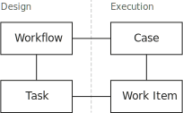

# Caluma Guide: Workflow

This guide explains the most important aspects of the _workflow_ capabilities of Caluma. First, we'll look at the concepts the workflow system is based on, and after at how these concepts can be applied in practice by using Caluma's GraphQL API.

## Concepts

When thinking about workflows, it helps to differentiate between two different steps of a workflow's lifecycle:

1. _Design_: First, the desired workflow is _designed_ by constructing it from its basic building blocks. For workflows those building blocks are called _tasks_ and the connections between them are called _flows_. Only when all the needed tasks and flows are specified, the design of a workflow is complete.

2. _Execution_: After the workflow is designed, it can be executed by creating an instance of it. An Instance of a workflow is called a _case_ and consists of _work items_, which are the instances of _tasks_.

The following picture summarizes the relationship between the various workflow entities and the phases they are concerned with:

In order to illustrate how the workflow entities are used, let's imagine a simple workflow that describes an exam in a school:

The "exam" workflow states that every exam consists of two steps:

1. The pupil fills out the exam
2. The teacher corrects the exam

The way the tasks are connected defines the order in which they are executed, i.e. that without a filled out exam there can also be no correction; or after the correction has started it can't be filled out any more.

Now that we know about the workflow's design, let's imagine this workflow being executed and visualize the different steps it passes through:

1. When a new "exam" case is started, Caluma creates a new "fill out exam" work item.

    

2. The exam is filled out, and the corresponding work item is completed. Caluma creates a new work item for the "correct exam" task.

    

3. The exam is corrected, and just as before the corresponding work item is completed. Since there are no more tasks following in the workflow's design, the whole case is marked as "complete".

    

The separation of _Design_ and _Execution_ allows having many "exam" cases  in different states at the same time:

Most workflows needed in real applications are more complex than the "exam" workflow we looked at in this example. To handle complex workflows, more building blocks are needed. The building blocks for workflows are called _Worfklow Patterns_, and you'll find all the patterns which are supported in Caluma in the docs (currently WIP).

---
> **Workflow Patterns and Standardization**
>
> Workflow Patterns in software applications are their very own field of research: The [Workflow Patterns initiative](http://www.workflowpatterns.com/) categorizes, visualizes and explains known patterns and compares their support in various software applications.
>
> When developing Caluma we try to incorporate as much of this research into our work as possible: The naming of our entities ("Workflow", "Case", "Task", "Work Item") stems directly from the workflow pattern initiative, and the workflow patterns we support are named according to the existing patterns.
>
> If you find that a specific workflow can't be implemented with the patterns that Caluma currently supports, then identifying and mentioning the workflow you need on the Workflow Patterns initiative is a great way to put your use-case in the right context and kick-start a possible implementation in Caluma. We're interested to support as many documented Workflow Patterns as possible, especially if their implementation doesn't add a great deal of complexity to the codebase - if you'd like to contribute to Caluma development by adding support for a new pattern, please reach out and we'll do our best to support you!
---

Now that we know about the concepts behind Caluma's workflow system, it's time to get our hands dirty and implement the "exam" workflow using the Caluma GraphQL API: [On to the next chapter, "Workflow implementation".](workflow-implementation.md)

## Workflow implementation

In this chapter, we'll create and execute the example "exam"
workflow which has been introduced in the [previous chapter,
"Workflow Concepts"](workflow-concepts.md). We'll do so by executing
mutations on the Caluma GraphQL API - to get most out of this
guide, we recommend to follow along using the interactive GraphiQL
console of your local Caluma installation (see the [Getting started
guide](../README.md#getting-started) for
installation instructions).
